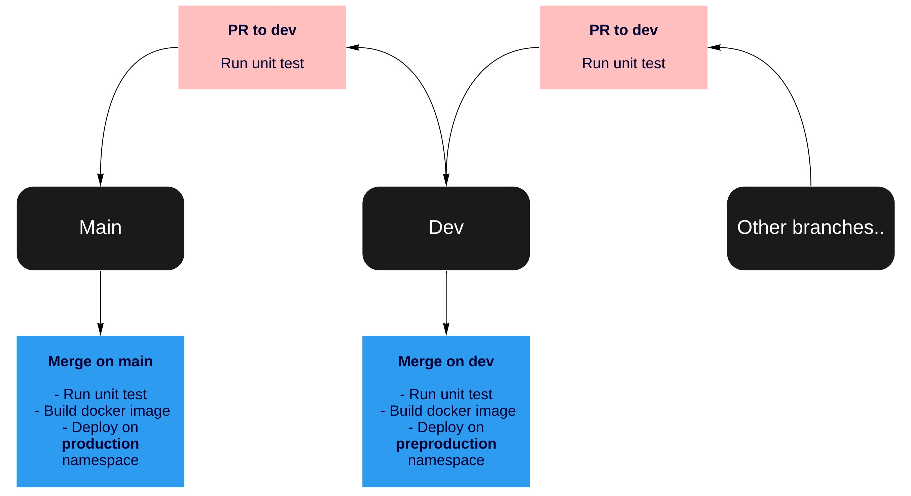
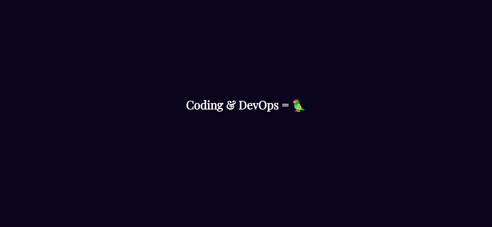

# Evoli 🐈

<p align="center">
  
</p>

Lulu Dans Ma Rue's technical test that a candidate for the DevOps / Fullstack developer position 🤓

## Subject 📝

The subject of this technical test is to automate the deployment of this repository to a **Kubernetes cluster which you will create**.

The app need to be automated to allow developers to easily deploy their works on the Kubernetes cluster. You can use, for example, a CI/CD pipeline based on the diagram below.

### Sum-up of the subject

- Create a Kubernetes cluster
- Automate the deployment of this app

<p align="center">
  
</p>

## Deploy the evoli app tips

- An existing **Dockerfile** already exist in the repository. You can re-use it to build the container
- You'll need to set an environment variable to the Kubernetes deployment. Below is the env setted in plain Kubernetes YAML spec

```yaml
env:
    name: ENV
    value: prod
```

- Unit test can be run with the command **cargo test**
- Lint can be run with the **cargo clippy** command. If you choose to use **github action** an existing actions already exist to do this steps
- The app is running on the **port 3000**.
- Don't bother with the Ingress. You can expose the app with the LoadBalancer type

## Test your deployment

Should everything works. Type the loadbalancer IP and you should see something similar to:

<p align="center">
  
</p>

## Tool constraint

You are *invited to use whatever tool* it seems necessary to resolve this technical test. We'll *focus* on the solutions that you'll bring to resolve this technical test.

## Duration of this test

The test has been designed to last for about 2 ~ 3 days.

## Questions

If you have any questions. Please contact me at marc.intha-amnouay@luludansmarue.org